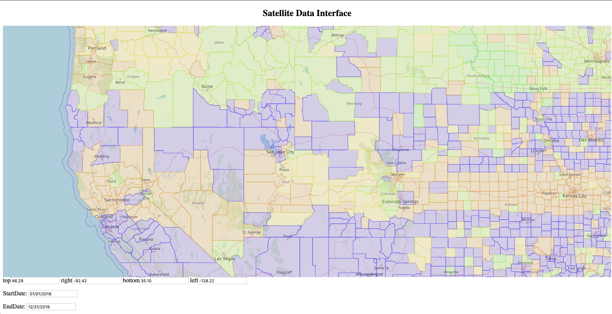

# Satellite-Date-Server 
## Ad-Hoc Querying of Satellite Data to Process Multiple Polygons


### Background 

The Satellite-Data-Server hosts satellite data to provide two main functions: 
1. Processing the data in aggregate using the Scanline method and 
2. Hosting the data to make available for users through a map interface. 

We execute the zonal statistics operation using the Scanline method. This method processes queries in aggregation, which 
combines vector and raster data in their raw formats. Read more about the Scanline method [here.](https://www.cs.ucr.edu/~eldawy/publications/19_VLDB_Raptor_Demo.pdf) 
We use these techniques to process multiple polygons at once, specified by the user. This allows for greater usability and 
to ensure efficiently processed polygons of interest. 

This system will allow users to query multiple polygons simultaneously based on what is visible on the map. 
These include different zoom-level granularities, e.g. state, county, and zip code level polygons. The backend server 
will compute a range of statistics: sum and count (of pixels), and min, max, average (of temperature in Kelvins). 

### Installations

1. Node Package Manager (To install run in terminal: ```npm install```)
2. Java Version 1.8

### Run the Application

#### 1. Clone this repository into your local machine 

 * ```git clone https://github.com/hsayedi/Satellite-Data-Server.git```

#### 2. Run the backend server

  * Navigate to src/main/java/SatelliteDataServer.java and run
  
#### 3. Start the node server. 

  * Navigate to map_interface/ directory
  * In terminal, run ```npm start``` 
  * You will see the server running at a given URL, i.e. ```http://localhost:1234```
  * Copy and paste the given URL into a browser
  
#### 4. In the web browser, select StartDate and EndDate

  * Because the sample of raster data is from January 1, 2018 to January 6, 2018 - select a dates in that range. 
  * Example: 
      * StartDate: Select January 1, 2018
      * EndDate: Select today's date

#### 5. Zoom into the United States (one zoom at a time) and you should see some state colors change. 

  * You will see U.S. states 
  * When zoomed in further, the polygons should change from states to counties

The screenshot below shows an example zoom level 



Note: Purple polygons inidicates an undefinied region, which is due to the small range of sample data we are using. You will 
notice a gradience of green to orange states. These shades indicate the aggregate temperatures for each given polygon. 


